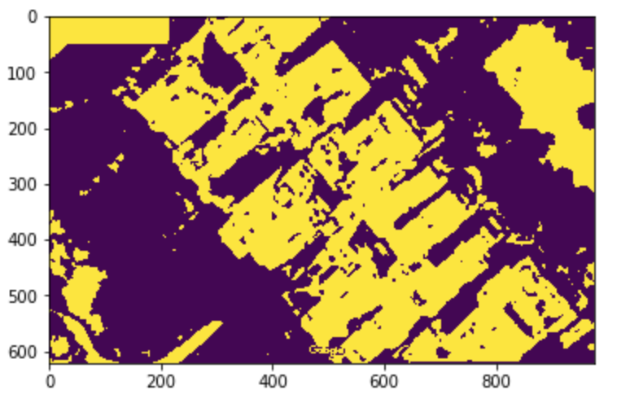

# 1.Kmeans Colour Segmentation Vegetation Removal
__Dataset:__ Satellite Images of different areas in delhi

__Requirements:__ 
  + Python 3
  + cv2 (OpenCV)
  + numpy
  + matplotlib
 
__Concepts used:__
  * K means clustering
  * Gaussian Blur
  * Morphology
  
__output (Coloured image is input | Yellow and Purple image is input):__

